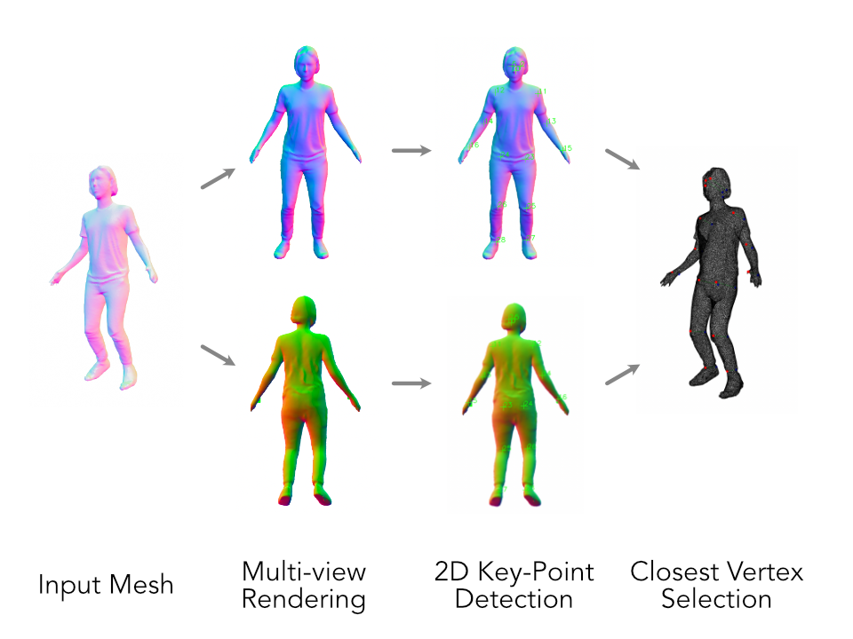

# Multiview 3D Keypoint Detection (Muke)
A simple approach to detect 3d keypoints by using 2d estimation methods and multiview rendering. The idea is based on the blender project for [automatic keypoint retopology](https://github.com/cansik/auto-keypoint-retopology).


*Muke Process*

### Installation

To install the package use the following pip command:

```bash
pip install muke
```

### Usage

#### Configuration

Example configuration:

```json
{
  "description": "MP Face",
  "detector": "media-pipe-face",
  "resolution": 1024,
  "generator": "wrap3",
  "views": [
    {
      "name": "frontal",
      "rotation": 0,
      "keypoints": [
        4,
        76,
        306
      ]
    }
  ]
}
```

Example on how to create a range (`skip` is optional):

```json
{
  "start": 10,
  "end": 15,
  "skip": [13, 14]
}
```

#### Demo

```bash
python -m muke assets/person.ply --display --resolution 1024
```

```bash
python -m muke temp/AlexedWrapped.obj --display --resolution 1024 --detector media-pipe-face
```

```bash
python -m muke temp/AlexedWrapped.obj --display --config config/media-pipe-face.json
```

#### Help

```bash
usage: muke [-h] [--detector {media-pipe-pose,media-pipe-face}] [--resolution RESOLUTION] [--generator {wrap3}]
            [--config CONFIG] [--display] [--debug]
            input

Detects keypoint locations in a 3d model.

positional arguments:
  input                 Input mesh to process.

optional arguments:
  -h, --help            show this help message and exit
  --detector {media-pipe-pose,media-pipe-face}
                        Detection method for 2d keypoint detection (default: media-pipe-pose).
  --resolution RESOLUTION
                        Render resolution for each view pass (default: 512).
  --generator {wrap3}   Generator methods for output generation (default: wrap3).
  --config CONFIG       Path to the configuration JSON file.
  --display             Shows result rendering with keypoints (default: False)
  --debug               Shows debug frames and information (default: False)
```

### Library
It is also possible to use Muke as a library to detect keypoints on an existing 3d mesh.

```python
import open3d as o3d

from muke.Muke import Muke
from muke.detector.MediaPipePoseDetector import MediaPipePoseDetector
from muke.model.DetectionView import DetectionView

# load mesh from filesystem
mesh = o3d.io.read_triangle_mesh("assets/person.ply")

# define rendered views
keypoint_indexes = {28, 27, 26, 25, 24, 23, 12, 11, 14, 13, 16, 15, 5, 2, 0}
views = [
    DetectionView("front", 0, keypoint_indexes),
    DetectionView("back", 180, keypoint_indexes),
]

# detect keypoints
with Muke(MediaPipePoseDetector()) as m:
    result = m.detect(mesh, views)

# present results
for kp in result:
    print(f"KP {kp.index}: {kp.x:.2f} {kp.y:.2f} {kp.z:.2f}")
```

### About
MIT License - Copyright (c) 2022 Florian Bruggisser