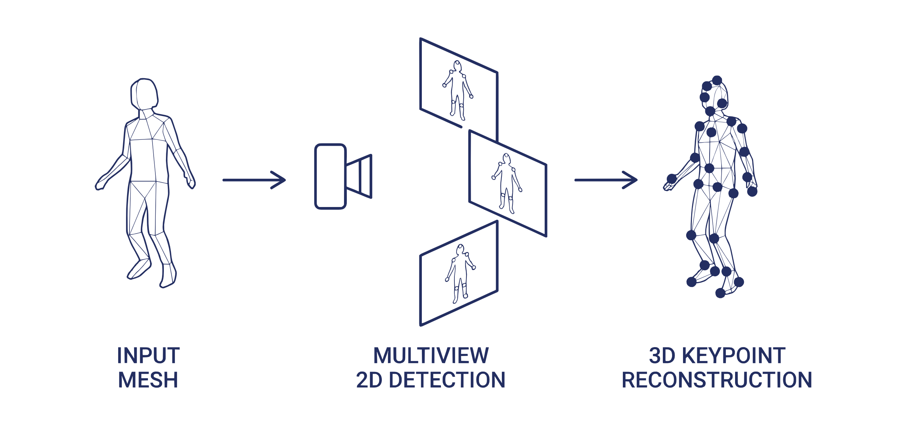
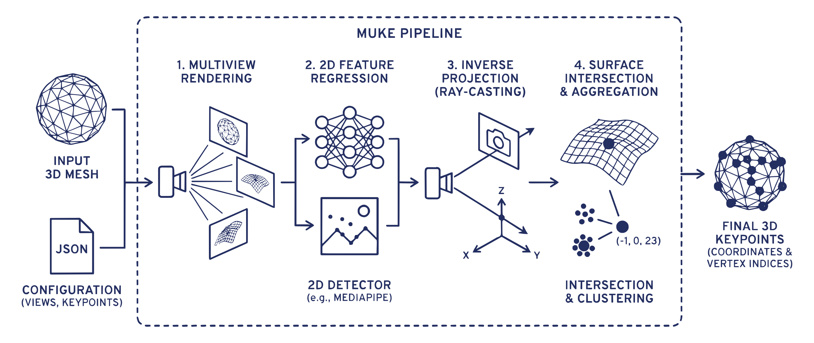
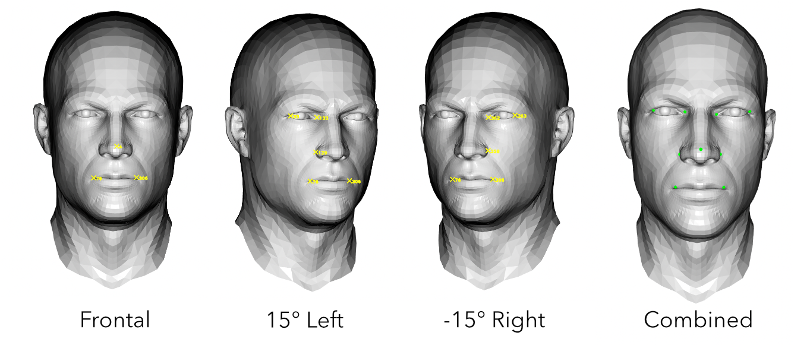

# Multiview 3D Keypoint Detection (Muke) [](https://pypi.org/project/muke/)

**Muke** is a robust framework for extracting 3D keypoints from meshes using multiview 2D estimation and geometric projection. It is based on the concept of [automatic keypoint retopology](https://github.com/cansik/auto-keypoint-retopology).


*Muke Process: Ray-casting from multiple views to determine surface points.*

### Methodology

The keypoint extraction pipeline leverages the robustness of 2D detection models to infer 3D geometry. The process is defined by the following stages:

1.  **Multiview Rendering**: The target 3D mesh is rendered from a series of calibrated camera viewpoints.
2.  **2D Feature Regression**: A 2D keypoint detector is applied to each rendered view to regress landmark coordinates in the image plane.
3.  **Inverse Projection (Ray-Casting)**: For every detected landmark, a ray is cast from the camera center through the corresponding pixel coordinates into the 3D scene.
4.  **Surface Intersection**: The algorithm computes the intersection of these rays with the mesh topology.
5.  **Spatial Aggregation**: Intersection points from disparate views are clustered and averaged to resolve the final 3D position and nearest vertex index.


*Overview of the detection pipeline.*

Direct 3D keypoint recognition on mesh data often requires complex training pipelines and limited datasets. By utilizing 2D recognition, Muke taps into the extensive "zoo" of pre-trained image recognition models. The library includes built-in support for [MediaPipe Face](https://ai.google.dev/edge/mediapipe/solutions/vision/face_detector) and [Pose Landmark](https://ai.google.dev/edge/mediapipe/solutions/vision/pose_landmarker), and is designed to be extensible for other frameworks.


*3D Facial Landmark Estimation (Human Head by [VistaPrime](https://sketchfab.com/3d-models/human-head-f46d952886ae4a8c8851341b810bba43) [CC Attribution](https://creativecommons.org/licenses/by/4.0/))*

### Applications

Originally developed for automatic retopology, Muke is suitable for various applications requiring semantic 3D keypoints, including:
*   **Auto-Rigging**: Automating skeleton placement based on surface features.
*   **Animation**: Driving blendshapes or bone deformations.
*   **Registration**: Aligning meshes based on semantic landmarks.

---

### Installation

Install the package via pip:

```bash
pip install muke
```

### Usage

Muke can be executed as a command-line tool to generate keypoint data in formats such as [Wrap3](https://www.russian3dscanner.com/).

#### Configuration

Create a JSON configuration file to define the detector, resolution, and rendering views.

**Example `config.json`:**

```json
{
  "description": "MP Face",
  "detector": "media-pipe-face",
  "resolution": 1024,
  "generator": "wrap3",
  "views": [
    {
      "name": "frontal",
      "rotation": 0,
      "keypoints": [4, 76, 306]
    }
  ]
}
```

**Keypoint Ranges:**
You can define ranges with optional skips:

```json
{
  "start": 10,
  "end": 15,
  "skip": [13, 14]
}
```

#### Infinite Ray
Setting `"infinite-ray": true` allows the ray to traverse the entire mesh. The final keypoint is calculated as the average center of all intersection points, which is useful for estimating internal volume centers.

#### Quick Start

Run Muke on provided assets:

```bash
# Basic pose detection
python -m muke assets/person.ply --display --resolution 1024

# Face detection
python -m muke assets/human_head.obj --display --resolution 1024 --detector media-pipe-face

# Using a configuration file
python -m muke assets/human_head.obj --config config/media-pipe-face.json --display
```

#### CLI Arguments

```text
usage: muke [-h] [--detector {media-pipe-pose,media-pipe-face}]
            [--resolution RESOLUTION] [--infinite-ray] [--generator {wrap3}]
            [--config CONFIG] [--load-raw] [--display] [--debug]
            input
```

### Development

Muke is designed to be integrated into Python pipelines.

#### Library Usage

```python
import open3d as o3d
from muke.Muke import Muke
from muke.detector.MediaPipePoseDetector import MediaPipePoseDetector
from muke.model.DetectionView import DetectionView

# 1. Load mesh
mesh = o3d.io.read_triangle_mesh("assets/person.ply")

# 2. Define views and keypoints of interest
keypoint_indexes = {0, 2, 5, 11, 12, 13, 14, 15, 16, 23, 24, 25, 26, 27, 28}
views = [
    DetectionView("front", 0, keypoint_indexes),
    DetectionView("back", 180, keypoint_indexes),
]

# 3. Detect
with Muke(MediaPipePoseDetector()) as m:
    result = m.detect(mesh, views)

# 4. Process results
for kp in result:
    print(f"KP {kp.index}: {kp.x:.2f} {kp.y:.2f} {kp.z:.2f}")
```

#### Custom Detectors

Implement the `BaseDetector` interface to add support for new models.

```python
import numpy as np
from muke.detector.BaseDetector import BaseDetector
from muke.detector.KeyPoint2 import KeyPoint2

class CustomDetector(BaseDetector):
    def setup(self):
        # Initialize model
        pass

    def detect(self, image: np.ndarray) -> list[KeyPoint2]:
        # Perform inference and return 2D keypoints
        pass

    def release(self):
        # Cleanup
        pass
```

### Technical Details

The rendering pipeline utilizes [pygfx](https://github.com/pygfx/pygfx) for lightweight offscreen rendering. Mesh loading is handled by [trimesh](https://github.com/mikedh/trimesh), and [Open3D](https://github.com/isl-org/Open3D) performs the ray-casting operations.

*   **Legacy Branches**:
    *   `trimesh-renderer`: Pure trimesh implementation.
    *   `open3d-renderer`: Pure Open3D implementation (archived).

## Credits

Developed at the [Immersive Arts Space](https://blog.zhdk.ch/immersivearts/), [Zurich University of the Arts (ZHdK)](https://www.zhdk.ch/).

Copyright © Zurich University of the Arts (ZHdK).
